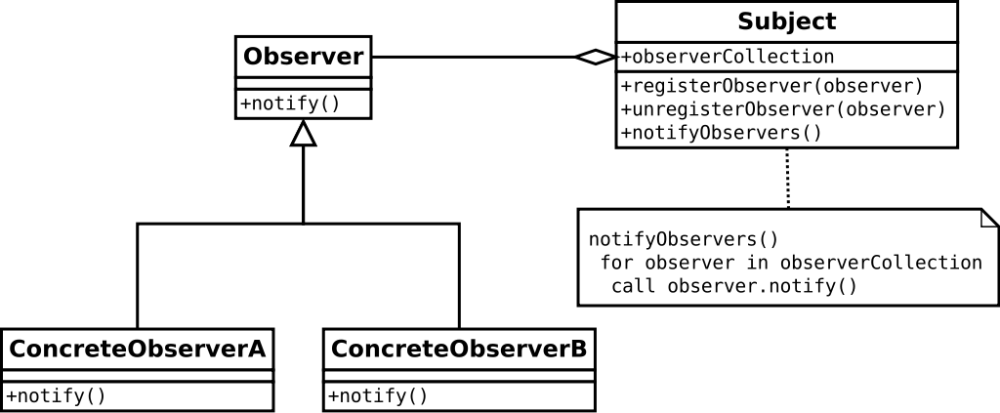

# project reactor原理分析

## 引言

spring cloud gateway目前是基于spring webflux上构建出来的（基于mvc的版本两年过去了还是在snapshot开发的状态下）。
而spring webflux是一个响应式编程web框架，其中的核心就是基于reactive streams规范开发出来的project reactor。在编写工作于webflux或spring cloud gateway
的代码时，如果不熟悉project reactor很可能会被很多突如其来的Mono、Flux的operator操作搞混的，甚至会写出较为影响性能的代码。

## 响应式编程

由于篇幅和时间关系，本文不打算对响应式编程作过多解释。

在我看来，响应式编程就是观察者模式的实现和扩展。

维基百科对于响应式编程的定义：
[wikipedia|reactive programming](https://zh.wikipedia.org/wiki/%E5%93%8D%E5%BA%94%E5%BC%8F%E7%BC%96%E7%A8%8B)

## project reactor

project reactor是spring框架的公司编写出来的响应式库，基于[github|reactive streams[3]][link:3]规范。
当然有兴趣，也可以看下jdk9的flow api。

### 核心模型

#### publisher

#### Subscriber 

#### Subscription 

### 运行流程

#### 声明阶段

## references

[1] [project reactor reference][link:1]

[2] [小马哥|Reactive programming 一种技术 各自表述](https://mercyblitz.github.io/2018/07/25/Reactive-Programming-%E4%B8%80%E7%A7%8D%E6%8A%80%E6%9C%AF-%E5%90%84%E8%87%AA%E8%A1%A8%E8%BF%B0/)

[3] [github|reactive streams][link:3]

[link:1]: https://projectreactor.io/docs/core/release/reference/docs/index.html
[link:3]: https://github.com/reactive-streams/reactive-streams-jvm/

